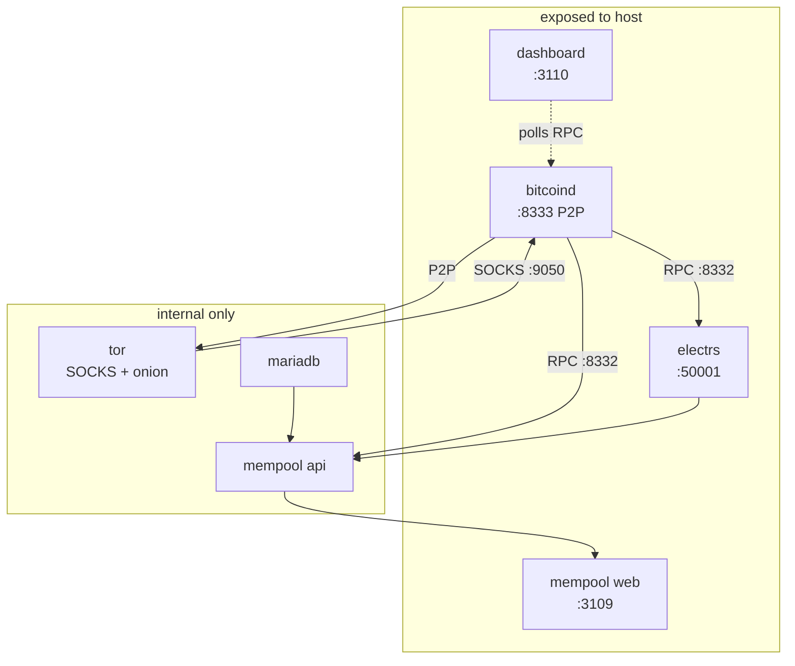

# Architecture

All services communicate over an isolated Docker bridge network (`172.28.0.0/16`). Only P2P, Electrum, mempool, and dashboard ports are exposed to the host.



## Data flow

- **bitcoind** is the core. It connects to the Bitcoin P2P network (optionally via Tor) and exposes RPC internally.
- **electrs** indexes the blockchain from bitcoind and serves the Electrum protocol.
- **mempool api** reads from both bitcoind (RPC) and electrs (Electrum protocol), stores statistics in **mariadb**.
- **mempool web** is the frontend served by nginx, backed by the API.
- **tor** provides a SOCKS proxy for outbound P2P and publishes a hidden service for inbound P2P (and optionally RPC).
- **dashboard** polls bitcoind's RPC and writes a health JSON served as a static page.

## Dependency chain

```
dashboard (generates secrets)
├── tor
├── db
└── bitcoind (depends on dashboard + tor)
    └── electrs (depends on dashboard + bitcoind)
        └── api (depends on dashboard + db + bitcoind + electrs)
            └── web (depends on api)
```
